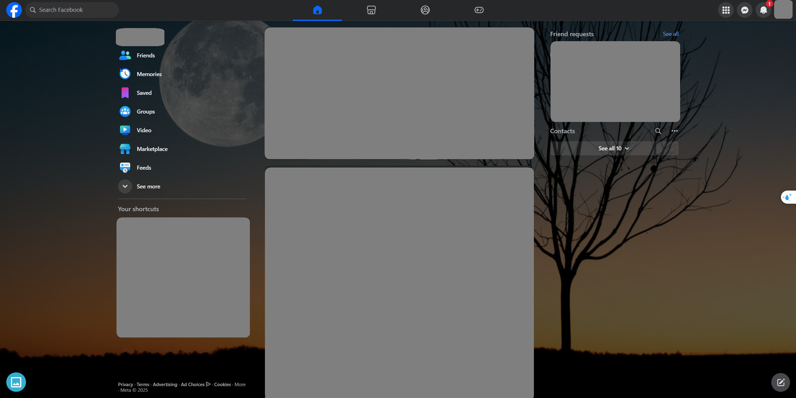

## Purpose
- Are you bored with the dark/light theme of Facebook?
- Do you want something fresh every day and want to decide which one?

If so, you're in the right place.
Here is a temporary script that will allow you to set a beautiful local image as a custom background for your Facebook.

## How to use
- Install the `tampermonkey` extension from the [Chrome Web Store](https://chromewebstore.google.com/detail/tampermonkey/dhdgffkkebhmkfjojejmpbldmpobfkfo) or [Firefox Browser Add-ons](https://addons.mozilla.org/en-US/firefox/addon/tampermonkey/)
- Click [here](https://greasyfork.org/en/scripts/525981-facebook-custom-background) to get the latest version of the script
- Reload the Facebook site
- Click the select image icon  on the bottom left to choose a beautiful image from your machine
- Enjoy the new look

## Demo
  

## Known bugs
- [ ] Theme is disappear on Light theme on Discussion view

## Incoming features  
- [x] Add opacity to card background color -> image can display fully. Refer [here](https://www.facebook.com/groups/j2team.community/posts/2594866807512090/?comment_id=2594963697502401)